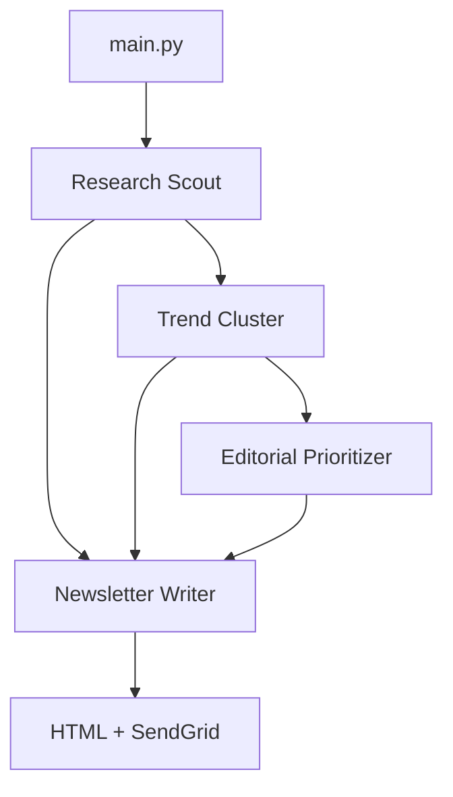

# AI Insights Newsletter

Multi-agent pipeline: research AI news → cluster themes → prioritize editorially → write newsletter → render HTML → send via SendGrid. Entry point: `main.py`.

## Workflow



Research, clusters, and editorial decisions all feed the Newsletter Writer. Prompts live in `system_prompts/`.

## Setup & Run

Requires Python 3.10+, [uv](https://docs.astral.sh/uv/getting-started/installation/), and a SendGrid account.

```bash
uv venv && source .venv/bin/activate
uv pip install openai-agents python-dotenv sendgrid
```

Create `.env`:

```env
OPENAI_API_KEY=...
SENDGRID_API_KEY=...
SENDGRID_FROM_EMAIL=verified_sender@example.com
SENDGRID_TO_EMAIL=recipient@example.com
```

```bash
uv run main.py
```

`SENDGRID_FROM_EMAIL` must be a verified SendGrid sender. Tune behavior via `system_prompts/`. See `sample_newsletter.html` for output style.
