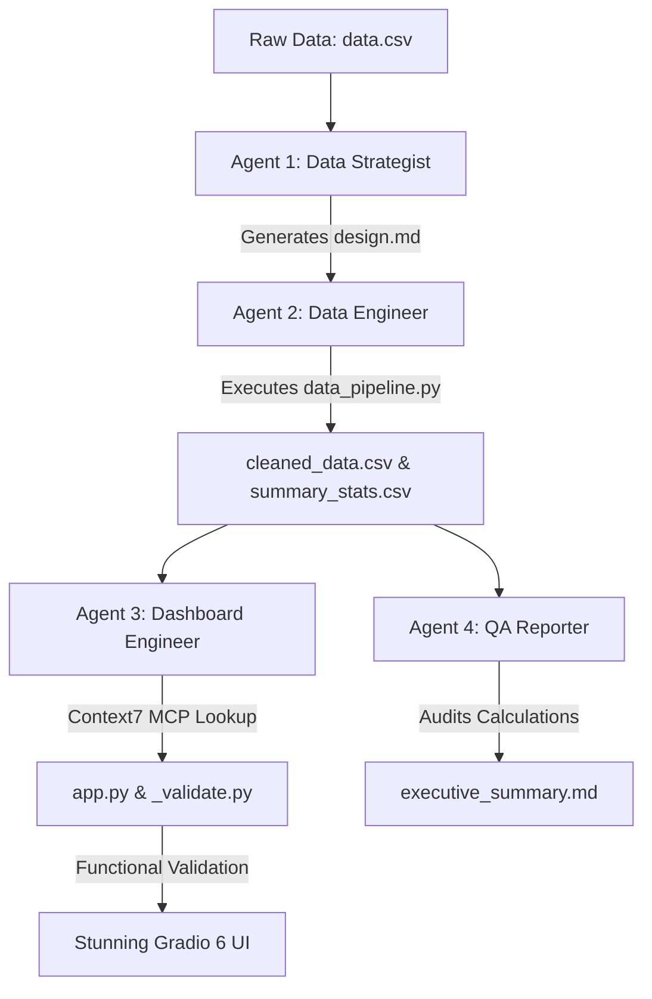

# 📊 Data Science & Business Intelligence AI Crew (`data_science_team`)

An autonomous, multi-agent AI system built with [crewAI](https://crewai.com) and powered by `deepseek-v4-flash` via OpenRouter. 

The **Data Science Crew** orchestrates 4 specialized AI agents to analyze raw e-commerce data (`data.csv`), design analytical strategies, build automated ETL data pipelines, create visually stunning Gradio 6 web dashboards, and generate executive QA business reports.

---

## 🎯 Architecture Overview



---

## 🤖 Meet the 4 AI Agents

| Agent | Role | Tools & Capabilities | Key Deliverable |
|:---|:---|:---|:---|
| **1. Data Strategist** | Lead BI Architect | Docker Sandbox Tools | `sandbox/design.md` |
| **2. Data Engineer** | Python Data Developer | Pandas, Numpy, Docker Sandbox | `sandbox/data_pipeline.py`<br>`sandbox/cleaned_data.csv`<br>`sandbox/summary_stats.csv` |
| **3. Dashboard Engineer** | Gradio 6 & Plotly Developer | Docker Sandbox Tools + **Context7 MCP** | `sandbox/app.py`<br>`sandbox/_validate.py` |
| **4. QA Reporter** | QA Auditor & Business Reporter | Docker Sandbox Tools | `sandbox/executive_summary.md` |

---

## 📸 Dashboard Preview & Screenshots

The generated **Sales Performance Dashboard** features a cohesive dark theme (`#0f0f1a`), glassmorphism HTML KPI cards, interactive Plotly charts, and instant multi-dimensional filtering.

| Preview | Description |
|:---:|:---|
|  | **Global Controls & Top KPI Cards**: Dynamic filter inputs (Region, Category, Customer Segment, Start/End Month Sliders) and KPI metric cards (Net Revenue, Total Orders, AOV, Profit Margin). |
|  | **Executive Overview Tab**: Monthly Net Revenue Trend line chart (2024) and Revenue Distribution by Category donut chart. |
|  | **Customer Segment Analytics**: Orders by Customer Segment bar chart and AOV by Customer Segment breakdown. |
|  | **Regional Revenue Breakdown**: Net Revenue by Region bar chart and Regional Revenue Share donut chart. |
|  | **Regional AOV & Heatmap**: AOV by Region bar chart and Region × Category Revenue Heatmap matrix ($). |
|  | **Product Performance Tab**: Top Products by Net Revenue horizontal ranking and Product Breakdown by Category stacked bar with interactive tooltip hover. |
|  | **Product Volume Analytics**: Total Units Sold per Product across all 16 items. |
|  | **Summary Data Tab**: Aggregated Summary Statistics Dataframe Table grouped by category and month. |
|  | **Cleaned Data Table**: Complete 200-order enriched dataset preview table with order IDs, dates, segments, and computed fields. |

---

## 📁 Directory Structure

```text
data_science_team/
├── pyproject.toml              # Root project dependencies (CrewAI, UV)
├── README.md                   # System documentation & usage guide
├── Screenshots/                # Visual artifacts & dashboard screenshots
│   ├── screenshot_01.png
│   ├── ...
│   └── screenshot_09.png
├── sandbox/                    # Isolated execution workspace
│   ├── data.csv                # Raw input dataset (200 orders)
│   ├── cleaned_data.csv        # Processed & enriched dataset (19 columns)
│   ├── summary_stats.csv       # Calculated KPI summary aggregations
│   ├── design.md               # Analytical design specification
│   ├── data_pipeline.py        # Automated ETL pipeline script
│   ├── app.py                  # Gradio 6 + Plotly dashboard application
│   ├── _validate.py            # Non-blocking callback validation script
│   └── executive_summary.md    # Executive business report
└── src/data_science_crew/
    ├── config/
    │   ├── agents.yaml         # Agent roles, goals, and backstories
    │   └── tasks.yaml          # Task descriptions, inputs, and contexts
    ├── tools/
    │   └── sandbox_tools.py    # Docker sandbox execution & reset tools
    ├── crew.py                 # CrewAI crew definition & MCP integration
    ├── main.py                 # CLI entrypoint & kickoff runner
    └── patch.py                # MCP patch side-effects
```

---

## 🚀 Quick Start Guide

### 1. Prerequisites & Installation

Ensure you have Python `>=3.10, <3.14` and [uv](https://docs.astral.sh/uv/) installed:

```bash
pip install uv
```

Install dependencies:
```bash
uv sync
```

### 2. Configure Environment Variables

Set your OpenRouter API key in `.env`:

```env
OPENROUTER_API_KEY=your_openrouter_api_key_here
```

### 3. Run the Autonomous Crew

Kick off the full multi-agent pipeline:

```bash
crewai run
```

### 4. Launch the Generated Dashboard

Once the crew completes execution, launch the Gradio 6 web dashboard locally:

```bash
cd sandbox
uv run app.py
```

Open your browser at **`http://localhost:7860`** to view the live dashboard!

---

## 🛠️ Key Technical Highlights & Innovations

* **Isolated Docker Sandbox**: All Python scripts generated by agents execute safely inside `ghcr.io/astral-sh/uv:python3.13-bookworm-slim` Docker containers.
* **Cross-Platform Container Isolation**: Configured `UV_PROJECT_ENVIRONMENT=/tmp/venv` inside Docker to prevent Windows host / Linux container `.venv` volume lock conflicts (`os error 17`).
* **Context7 MCP Integration**: The `dashboard_engineer` agent leverages Context7 MCP tools to query real-time Gradio 6 API syntax during code generation.
* **Functional Validation**: `_validate.py` executes non-blocking verification by invoking dashboard callbacks (`update_dashboard`) with real sample data to catch `KeyError` or `TypeError` exceptions before runtime launch.
